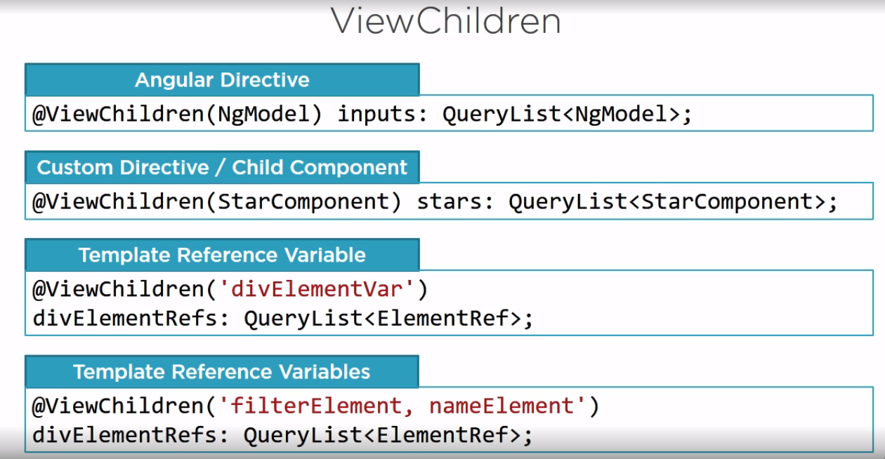
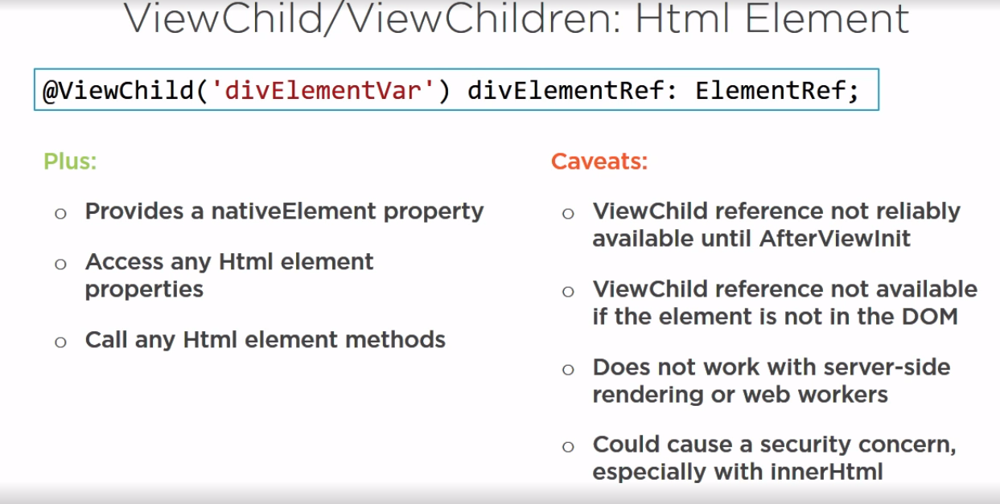
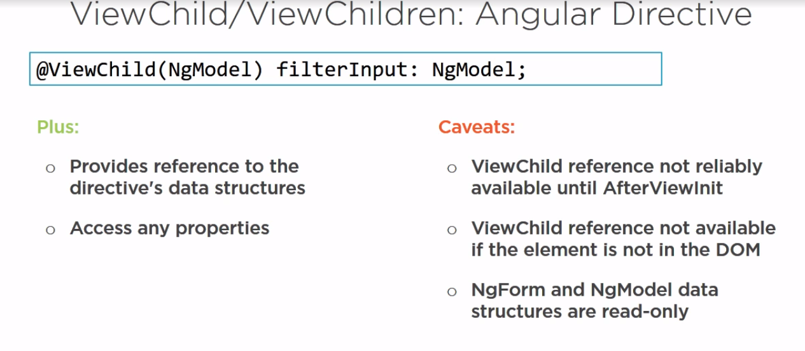

# Communicating with an element

# ViewChild

## Using ViewChild or ViewChildren to access an HTML element in the template provides a nativeElement property to reference its native element. We can then access any of its HTML element properties or call any of its HTML element methods, such as the focus method used in our example. A few caveats with this technique. The ViewChild reference is not reliably available until the AfterViewInit lifecycle hook.

