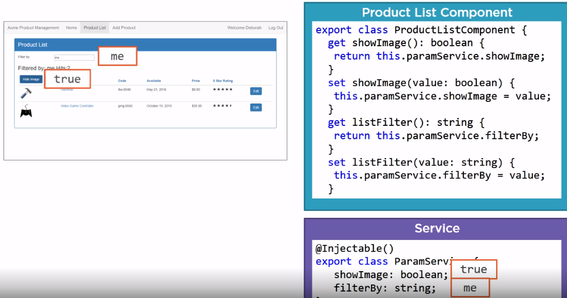
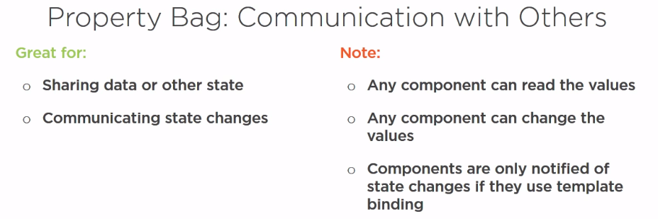
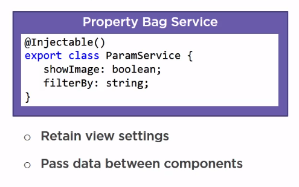

## Communicating Through a Service

An Angular service is a class that can provide functionality above and beyond our components. We can build a service to provide cross-cutting tasks, such as logging; perform operations, such as calculations or business logic; encapsulate functionality, such as data access; or share data beyond the lifetime of a component or across components. By default, services are basically singletons, which means that Angular maintains a single instance of the service.

#### Property Bag

Use a property bag service as a mechanism for a component to communicate with its future self. In this capacity, a property bag service is great for retaining view state or user selections.

