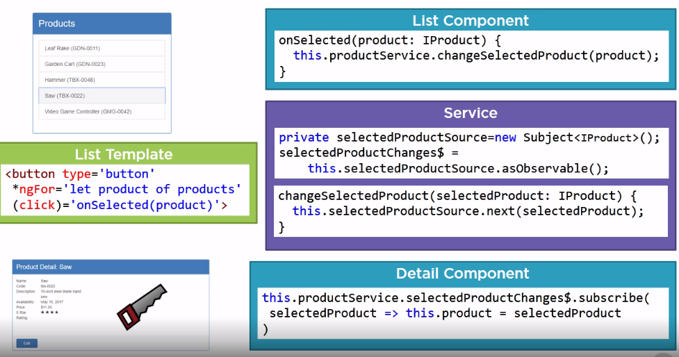

## Communicating Through Service Notifications

#### Service Notifications

#### Subject

A key purpose of a subject is to send out notifications. We can use a subject anywhere in our applications, but often encapsulate them in a service.
A subject is a special type of observable that can multicast a value or event to multiple subscribers. Any component or service that subscribes to the subject's observable will receive notifications. A subject is also an observer. An observer allows us to push new data into an observable sequence. Any component or other service can feed new values into the subject using its next method. The new value is then multicast to all subscribers.

#### Behavirial Subject

A BehaviorSubject works like a subject except for two key features. It requires an initial value, and it always provides the current value on any new subscription. When the user navigates between the product shell page and the product edit page, the product shell page, along with its children, are destroyed. The edit page is initialized and displayed. When the user completes or cancels the edit, the edit page is destroyed, and the product shell page again appears. Throughout this process, our service still retains the last selected product. When the product shell and product shell detail components are initialized, they again subscribe to the selectedProductChanges\$ observable. Only this time, since we are using a BehaviorSubject, it provides the last selected product on each new subscription so the components can react accordingly.

