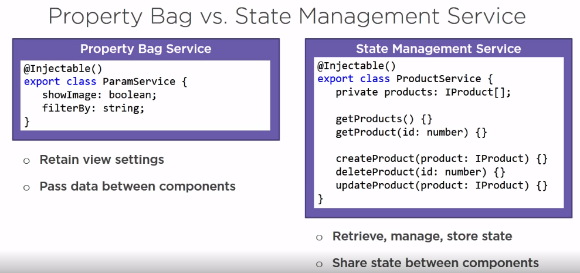
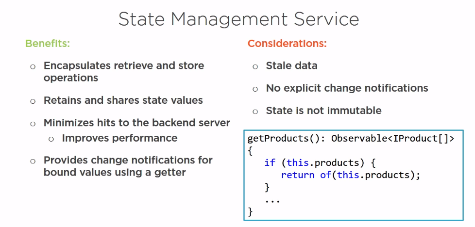
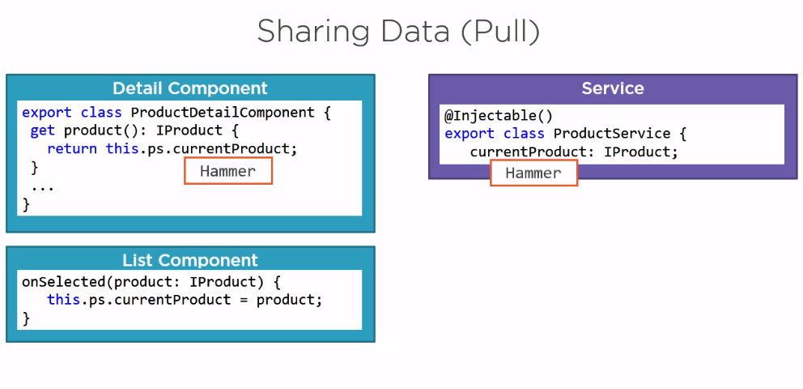
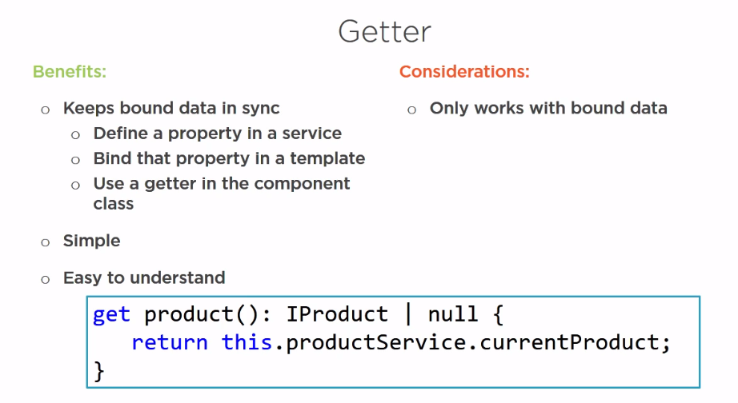
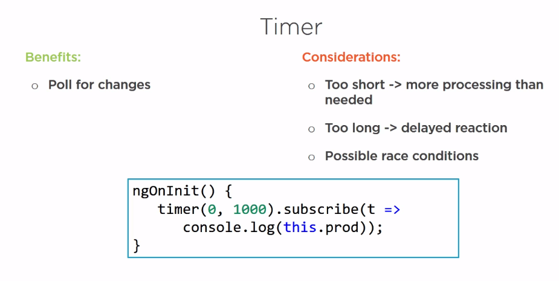

## State Management

#### Difference between Property Bag and State Management

#### Sharing Entity State

To turn a basic data access service into a state management service, we need to add a property to retain the list of entities. This property is populated the first time we retrieve the data, and any other requests for the data use this property.

#### Keeping state in sync

one way to provide communication between two components is with a property in a service. In this case, we want a property for the currently selected product. This list component would set the property when the user selects a product, and the detail component could read this property to obtain the current selected product and display the appropriate details.

##### Getter

If we replace the product property declaration with a getter, Angular's change detection will get the latest value from the service every time it's changed. The getter returns a product or null if there is no current product using the union type. Within the getter, we return the productService. currentProduct property value.

#### Change Detection

The change detection watches for changes to the bound property values and updates the binding when it sees any changes to those properties.

