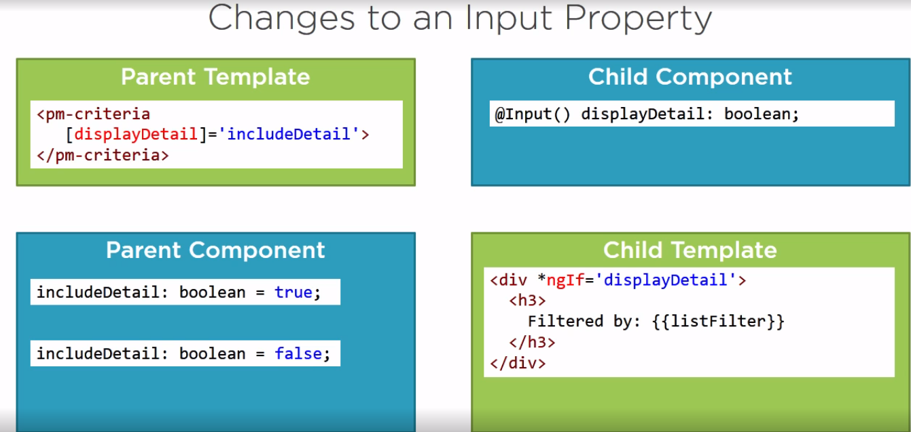
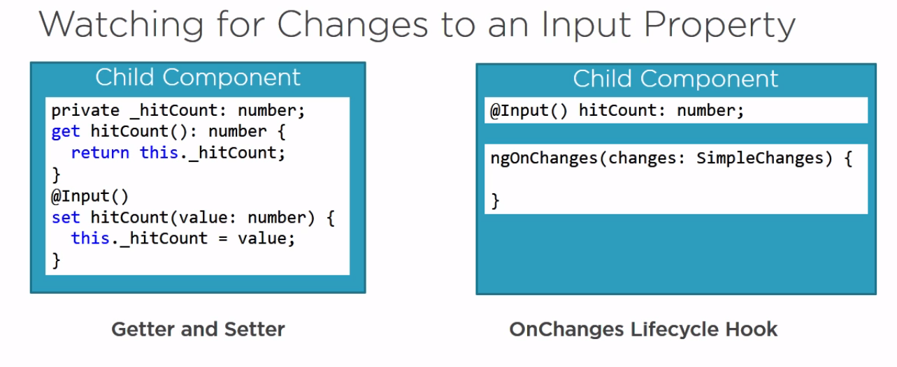
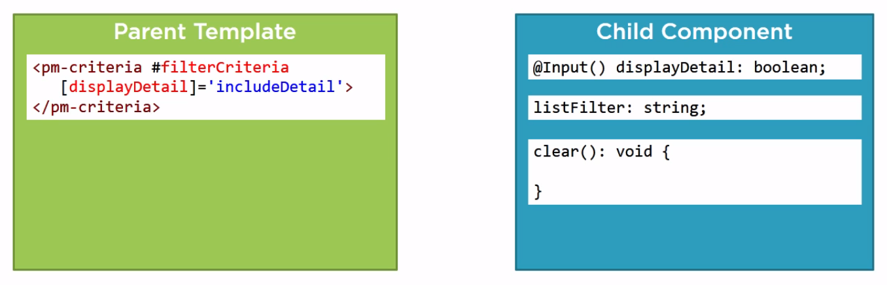
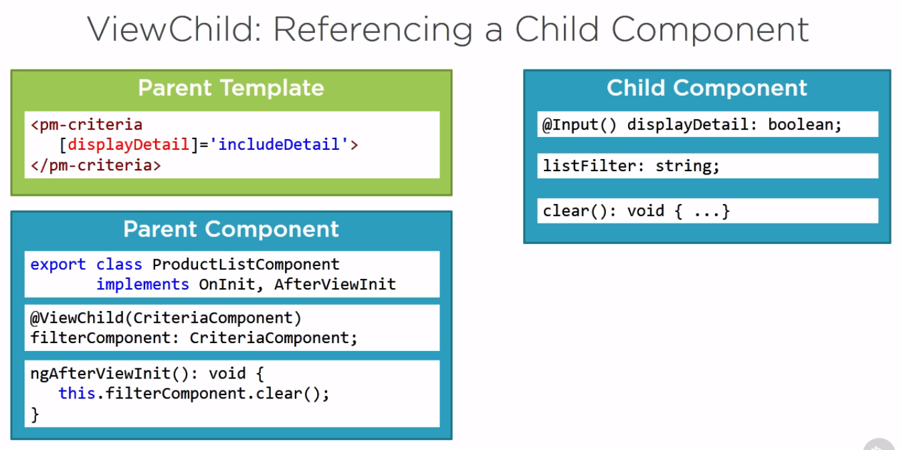
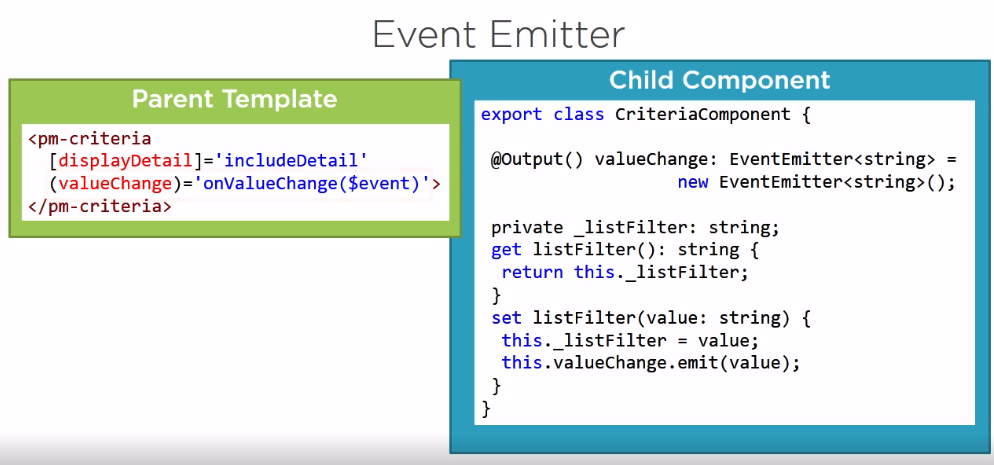
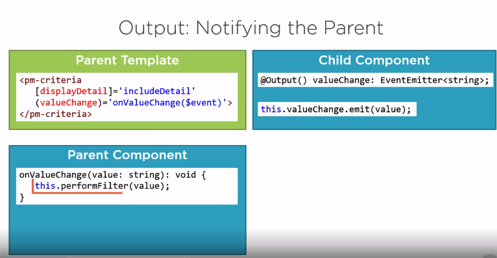

## Communnicate with child Element

#### Changes To an Input Property

#### Child component react when an input changes in parent componet

Often, the best way to pass data from a parent component to a child is through an input property, which is a property in the child component decorated with the Input decorator. If the child component needs to perform an operation when the input property is changed, we can use a **getter and setter or the OnChanges lifecycle hook in the child component**. Favor the getter or setter approach if the child component has multiple input properties and you only need to react to changes to a select set of them. Favor the OnChanges lifecycle hook to react to any input property changes or if you need access to the current and prior values. **Note that these techniques are for when the parent component changes an input property and the child component must react to that change**.

##### Access Child Component property in the Parent Component using Templete Reference Variable

A parent component can also directly reference a child component to request information from its properties or to perform an action by calling its methods. Use a template reference variable to reference the child component from the parent's template.

#### Access Child Component property in the Parent Component using ViewChild

The ViewChild technique did not allow our parent component's class to watch for changes to the child component's properties.

#### Child To parent by Event Emitter

